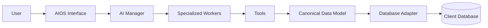
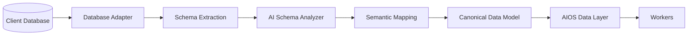
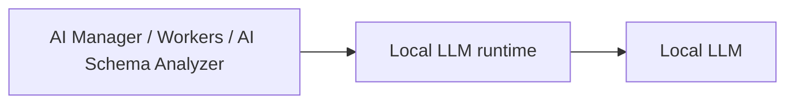

# Analisis Kebutuhan — AIOS Plugin Platform

**Proyek:** Prototype AIOS Plugin Platform (Immersion Program)
**Pelaksana:** Samuel Karel Augusta / 233016011
**Mitra:** Ekasa Technology (software house)
**Periode:** 10 Agustus 2026 – 12 Desember 2026 (18 minggu)
**Status:** Rev — disinkronkan dengan `AGENTS.md` dan `REQUIREMENTS.md`

> Dokumen ini menyajikan **konteks proyek** (latar belakang, tujuan, manfaat,
> cakupan, risiko, dan teknologi). Detail kebutuhan fungsional, acceptance
> criteria, dan use case tidak diduplikasi di sini — sumber resminya adalah
> `REQUIREMENTS.md` dan `docs/use-case-description.md`.

---

## 1. Ringkasan Eksekutif

AIOS (*AI Operating System*) adalah **platform AI multi-tenant SaaS** yang
di-host Ekasa. Setiap perusahaan client login ke workspace-nya sendiri, tidak
ada yang perlu dipasang atau di-embed di aplikasi client. AIOS berperan sebagai
*layer* AI di atas sistem perusahaan yang sudah berjalan: tujuannya bukan
mengganti aplikasi client, melainkan menambahkan kemampuan AI (menjawab
pertanyaan, menganalisis data) tanpa client harus membangun ulang sistemnya.

Prinsip utama: **CLIENT SYSTEM STAYS. AIOS ADAPTS.** AIOS harus bisa menempel
pada client dengan struktur database yang berbeda-beda melalui analisis skema
secara semantik berbasis *local LLM*, sesuai alur *plug in → adapt → understand
→ persist metadata → use*.

Model interaksi: AIOS **bukan chatbot umum tunggal**. AIOS dipandang seperti
organisasi dengan **9 cabang bidang (modul ERP)**; setiap cabang dikepalai satu
**AI Primary Agent** yang mengoordinasikan **sub-agents** (worker AI) pada
bidangnya. Ada dua role eksternal: **Client** (perusahaan pemakai AIOS) dan
**Ekasa Developer** (monitoring pemakaian). Portal Client dan portal monitoring
Ekasa Developer berada di **domain terpisah** (website terpisah), contoh
`client.aios.*` dan `developer.aios.*`; role ditentukan dari domain portal
(tanpa menu pilih role) dan diverifikasi server-side, dan kedua portal berbagi
satu backend serta satu AIOS Internal Database yang sama.

Pada prototype, penanganan dokumen (RAG) **di-defer**; fokus adalah data
terstruktur dari Client Database.

---

## 2. Latar Belakang

### 2.1 Konteks Ekasa Technology

Ekasa Technology adalah *software house* yang bekerja berdasarkan permintaan
*client*. Setiap permintaan *client* umumnya memiliki sistem *existing* dengan
arsitektur dan struktur *database* yang berbeda-beda. Ketika sebuah *client*
ingin menambahkan kemampuan AI pada sistemnya, pendekatan yang umum terjadi
adalah membangun solusi AI baru dari nol untuk setiap *client* — mahal, lambat,
dan tidak dapat digunakan kembali.

### 2.2 Masalah

1. Tidak ada *layer* AI yang **reusable** lintas *client*.
2. Memahami struktur *database client* yang beragam biasanya dilakukan dengan
   *mapping* manual / *hardcoded* yang hanya berlaku untuk satu *client*.
3. Penerapan AI sering dikaitkan dengan *cloud LLM*, sementara banyak *client*
   membutuhkan solusi yang menjaga privasi data.
4. Setiap *client* harus membangun solusi AI terpisah sehingga adopsi AI mahal.

### 2.3 Mengapa AIOS

AIOS dirancang sebagai *plugin/layer* SaaS yang **beradaptasi terhadap client**,
bukan sebaliknya. Dengan *AI Schema Analyzer* yang memahami struktur *database*
secara semantik, AIOS dapat mengenali bahwa `products.product_name`,
`barang.nama_barang`, dan `m_01.x2` dapat berarti hal yang sama dalam bentuk
*canonical data model*. Dengan begitu, satu platform dapat dipasang ke banyak
*client* dengan upaya integrasi yang jauh lebih kecil. Semua 9 cabang bidang
selalu tersedia untuk setiap client; jawaban menyesuaikan data yang benar-benar
tersedia pada database client.

---

## 3. Masalah yang Ingin Diselesaikan

1. **Keterbatasan reuse** — tidak ada AI *layer* yang bisa dipasang ke berbagai
   sistem client dengan cara yang sama.
2. **Ketergantungan pada struktur** — analisis data hanya bisa dilakukan jika
   programmer memahami dan menulis query spesifik per *client*.
3. **Privasi / lokalitas** — kebutuhan AI yang berjalan lokal (kandidat:
   Ollama) tanpa *cloud LLM*.
4. **Mahalnya adopsi AI** — setiap *client* harus membangun solusi AI terpisah.

---

## 4. Tujuan

### 4.1 Tujuan Umum

Membangun prototype AIOS Plugin Platform yang membuktikan bahwa satu platform AI
dapat dipasang ke sistem *client* yang berbeda-beda tanpa mengubah sistem
*existing*, sesuai prinsip **"plug in, adapt, use"**.

### 4.2 Tujuan Khusus (Prototype Scope)

Prototype dianggap berhasil jika kriteria acceptance pada `REQUIREMENTS.md`
(**AC-01 s.d. AC-21**) dapat didemonstrasikan, antara lain:

1. AIOS terintegrasi sebagai plugin SaaS tanpa mengubah sistem client.
2. Client dapat registrasi, login, membayar (gateway, aktivasi otomatis).
3. Client menghubungkan database perusahaannya (onboarding gate) dan memvalidasi
   hasil mapping di UI (confidence, konfirmasi, edit manual).
4. Client memilih 1 dari 9 bidang ERP dan chat dengan AI Primary Agent.
5. AI Primary Agent mendelegasikan pertanyaan ke sub-agent yang sesuai; sub-agent
   tidak mengarang data yang tidak tersedia.
6. Data Access Agent (per tenant) memahami skema client, menyimpan mapping di
   AIOS Internal Database, dan menyediakan business data aktual.
7. Memory Agent (per bidang) merangkum percakapan agar konteks terjaga.
8. Ekasa Developer memantau pemakaian token per perusahaan (drill-down per
   bidang/worker).
9. Re-adaptasi otomatis saat skema client berubah (dengan pop-up konfirmasi).
10. Seluruh alur dapat didemonstrasikan melalui interface.

### 4.3 Tujuan Magang

1. Menguasai *AI orchestration*: AI Manager, plugin registry, worker system,
   dan tool system.
2. Menerapkan integrasi *local LLM* (kandidat runtime: Ollama; final **TBD**).
3. Mempraktikkan pola arsitektur adaptif untuk *database* heterogen
   (*schema analyzer* + *canonical model*).
4. Menghasilkan *prototype*, laporan, dan demo yang memenuhi penilaian mentor,
   pemilik Ekasa Technology, dan dosen pembimbing program.

---

## 5. Manfaat

### 5.1 Bagi Ekasa Technology

- Menjadi **produk konsep** yang dapat ditawarkan kepada *client* sebagai
  tambahan AI *capability* pada sistem mereka.
- Mengurangi biaya dan waktu integrasi AI karena memakai satu platform yang
  adaptif, bukan solusi sekali pakai per *client*.
- Modal pembicaraan bisnis dengan *client*: "tambahkan AI tanpa mengubah
  sistem Anda."

### 5.2 Bagi Client

- Mendapatkan kemampuan AI tanpa harus membangun ulang / mengubah sistem
  *existing*; cukup menghubungkan database perusahaannya.
- Business data tetap berada di database mereka (Client Database tetap menjadi
  source of truth; AIOS hanya menyimpan metadata, mapping, dan state).

### 5.3 Bagi Pemagang

- Pengalaman nyata membangun arsitektur AI modular dan adaptif.
- Kompetensi baru: *LLM integration*, *prompt engineering*, analisis skema
  *database* berbasis AI.
- Portfolio prototype yang lengkap dan dapat didemonstrasikan.

### 5.4 Bagi Program Studi

- Implementasi nyata kegiatan *Immersion Program* yang menghubungkan teori
  kuliah dengan kebutuhan dunia kerja.
- Memperkuat kerja sama kampus dengan industri (*software house*).

---

## 6. Cakupan (In-Scope)

1. Arsitektur inti AIOS: AI Manager, Plugin Manager, Worker System, Tool System.
2. Integrasi *local LLM* (kandidat runtime: Ollama; final **TBD**) untuk semua
   peran.
3. *Database Adapter* + *Schema Extraction* + AI Schema Analyzer (pemahaman
   semantik skema).
4. *Canonical Data Model* + *semantic mapping* yang dipersistenkan di AIOS
   Internal Database (versi/status/confidence).
5. Data Access Agent (per tenant) untuk database adaptation dan penyediaan data
   aktual.
6. Memory Agent (per bidang) untuk ringkasan percakapan.
7. Autentikasi multi-tenant (Client & Ekasa Developer), registrasi, dan
   pembayaran via payment gateway.
8. *AIOS Interface*: home 9 bidang, workspace chat, onboarding & validasi
   mapping di portal client (`client.aios.*`); dashboard monitoring Ekasa
   Developer di portal domain terpisah (`developer.aios.*`).
9. Simulasi integrasi ke beberapa struktur *database* client yang berbeda.
10. *End-to-end testing* + dokumentasi + demo.

---

## 7. Batasan Masalah dan Non-Goals

### 7.1 Batasan Teknis

- Durasi: 18 minggu (10 Agustus – 12 Desember 2026).
- Berjalan **lokal** (kandidat: Ollama), tanpa *cloud LLM* kecuali ada alasan
  teknis jelas.
- Hardware: AMD Ryzen 5 5600G, 16 GB RAM, tanpa GPU dedicated (CPU-only).
  Model harus kecil dan ringan.
- Prototype tidak *production-ready*, namun setiap fitur inti harus benar-benar
  berfungsi untuk membuktikan *feasibility*.

### 7.2 Non-Goals (yang TIDAK dilakukan)

- **Bukan** chatbot generik tunggal; AIOS mengekspos kapabilitas/worker
  spesifik.
- **Bukan** pengganti (*replacement*) sistem *client*.
- **Bukan** *database-specific AI*; tidak ada asumsi hardcoded pada skema client.
- **Bukan** *worker* yang *direct-access database*; akses lewat AIOS Data Layer /
  canonical model / Database Adapter.
- **Bukan** *hardcoded mapping* untuk setiap *client*.
- **Bukan** sistem autentikasi pengganti aplikasi client — AIOS memiliki
  autentikasi SaaS sendiri (login per perusahaan), sementara autentikasi
  aplikasi client tetap berfungsi seperti sebelumnya.
- **Bukan** *cloud-only AI*.
- **Bukan** AI yang butuh *retraining* untuk setiap *client*.
- **RAG / dokumen di-defer** — penanganan dokumen (unggah, sub-agent pembaca
  dokumen) berada di luar scope prototype ini dan dapat menjadi fase berikutnya.
- Tidak mengubah *database client* agar cocok dengan AIOS.

---

## 8. Stakeholder dan User

| Stakeholder | Peran | Kebutuhan Utama |
|---|---|---|
| **Client** | Perusahaan pengguna AIOS (satu role) | AI *capability* tanpa mengubah sistem mereka; validasi mapping sendiri |
| **Ekasa Developer** | Internal Ekasa (monitoring) | Memantau pemakaian token per perusahaan (drill-down per bidang/worker) melalui portal monitoring di domain terpisah |
| **Ekasa Technology** | Mitra / penyedia jasa | Produk AIOS yang bisa ditawarkan ke banyak client |
| **Pemagang (Samuel)** | Pelaksana & pengembang | Prototype lengkap, kompetensi baru, portfolio |
| **Mentor / Pemilik Ekasa** | Pembimbing & penilai | Kualitas prototype, kesesuaian kebutuhan |
| **Dosen Pembimbing Program** | Penilai akademik | Dokumentasi, laporan, presentasi |

---

## 9. Use Case / User Stories

Daftar use case lengkap (aktor, alur, relasi) ada di
`docs/use-case-description.md` (use case **C1–C14** dan **D1–D2**).

Contoh user story yang menggambarkan inti pengalaman:

1. *"Sebagai client, saya mendaftar, login, dan membayar, lalu menghubungkan
   database perusahaan saya; AIOS memahami strukturnya dan saya memvalidasi
   mapping di UI."*
2. *"Sebagai client, saya memilih bidang Finance, lalu bertanya tentang data
   penjualan; AI Primary Agent mendelegasikan ke sub-agent yang sesuai dan
   jawabannya memakai data aktual dari database saya."*
3. *"Sebagai client, ketika struktur database saya berubah, AIOS memberi tahu
   dan meminta konfirmasi mapping yang diperbarui."*
4. *"Sebagai Ekasa Developer, saya melihat dashboard pemakaian token tiap akun
   client beserta AI Manager yang paling banyak dipakai."*

Use case diagram dan flowchart disimpan sebagai file `.drawio` di
`docs/diagrams/`.

---

## 10. Kebutuhan Fungsional (FR)

Detail kebutuhan fungsional ada di `REQUIREMENTS.md` (**FR-01 s.d. FR-40**),
termasuk autentikasi multi-tenant, onboarding data client, Data Access Agent,
dan Memory Agent. Dokumen ini tidak menduplikasinya.

---

## 11. Kebutuhan Non-Fungsional (NFR)

| ID | Aspek | Kebutuhan |
|---|---|---|
| NFR-01 | *Modularity* | Komponen (AI Manager, Plugin, Worker, Tool, Adapter) terpisah dan dapat diganti |
| NFR-02 | *Client adaptability* | Tidak ada asumsi *hardcoded* tentang nama tabel/kolom client |
| NFR-03 | *Local-first* | Berjalan dengan Local LLM (kandidat: Ollama); pada prototype di server Ekasa |
| NFR-04 | *Security & data privacy* | Worker tidak *direct-access* database; akses lewat *canonical model*; isolasi antar tenant |
| NFR-05 | *Performance* | Ringan; model dibatasi ukuran agar muat di 16 GB RAM CPU-only |
| NFR-06 | *Maintainability* | Kode sederhana, terdokumentasi, tidak *over-engineered* |
| NFR-07 | *Configurability* | Model/worker dapat diganti via konfigurasi, tanpa ubah kode |
| NFR-08 | *Simplicity* | Tidak menambah framework/library tanpa alasan jelas |

---

## 12. Arsitektur dan Alur Sistem

### 12.1 Alur Interaksi



Alur user:

```
User → Login (SaaS per perusahaan) → Home (9 bidang mengelilingi hub AIOS)
     → Pilih Bidang → AI Primary Agent (agent primary)
     → Delegasi ke sub-agent (sub-agent) → Tools / Data → Response
```

> Login dilakukan per domain portal: Client di `client.aios.*`, Ekasa Developer
> di `developer.aios.*`; role tidak dipilih manual, ditentukan oleh domain.

### 12.2 Client Integration



*Client* tetap mempertahankan aplikasi, database, authentication, dan business
logic mereka. AIOS hanya menambah *layer* AI di atasnya; Client Database tetap
menjadi source of truth business data.

### 12.3 AIOS Internal Database

AIOS Internal Database menyimpan metadata, mapping, konfigurasi, percakapan,
dan state AIOS — **bukan** salinan business data client. Antara lain: client
metadata, connection metadata, schema metadata, semantic mapping (versi/status/
confidence), plugin/worker configuration, percakapan & ringkasan memory
(tagged per bidang), dan usage/token metering.

Pemisahan domain portal (Client vs Ekasa Developer) **tidak** mengubah desain
database: AIOS Internal Database tetap satu (multi-tenant) dan dipakai bersama
oleh kedua portal.

Teknologi engine IDB masih **open decision (TBD)**: IDB wajib berjalan local /
self-hosted (bukan serverless / cloud-managed database service), **PostgreSQL
(self-hosted) adalah kandidat utama** yang dievaluasi, dan **SQLite tetap kandidat
alternatif — bukan keputusan final**. Keputusan final dibuat berdasarkan hasil
evaluasi/PoC, dan IDB dirancang database-agnostic sehingga engine dapat diganti
tanpa mengubah arsitektur (`REQUIREMENTS.md` IDB-13, IDB-28 s.d. IDB-30).

### 12.4 Local AI



### 12.5 Catatan

- Diagram resmi (flowchart, use case, arsitektur) disimpan sebagai file
  `.drawio` di folder `docs/diagrams/` (Lampiran A).
- *RAG pipeline* **tidak dicampur** dengan *database schema adaptation* dan
  **di-defer** pada prototype ini.

---

## 13. Teknologi

| Komponen | Pilihan | Catatan |
|---|---|---|
| Backend | Python (FastAPI) | Sesuai `ADR-002` |
| Frontend | Vue (JavaScript/TypeScript) | Portal client & developer; struktur terpisah dari backend |
| *Local LLM* | Ollama (kandidat), final **TBD** | Runtime final belum diputuskan (`ADR-004`; `REQUIREMENTS.md` LLM-05: **TBD**); model harus kecil/ringan untuk CPU-only |
| *Database Adapter* | SQLite, PostgreSQL, MySQL | Untuk **Client Database**: prototype memakai **SQLite** untuk klien simulasi (`ADR-003`); PostgreSQL/MySQL via adapter nanti |
| *AIOS Internal Database* | PostgreSQL (self-hosted), SQLite | Engine **TBD**: PostgreSQL kandidat utama (self-hosted), SQLite kandidat alternatif; local/self-hosted, tanpa serverless/cloud (`ADR-003`; `REQUIREMENTS.md` IDB-13, IDB-28 s.d. IDB-30) |
| *Dataset sample* | Beberapa struktur client yang sengaja berbeda | Memvalidasi adaptability (nama tabel/kolom, relasi, representasi berbeda) |
| *Embedding / vector store* | – | Untuk RAG, yang di-defer pada prototype |

---

## 14. Risiko dan Mitigasi

| Risiko | Dampak | Mitigasi |
|---|---|---|
| Kualitas analisis schema model kecil kurang akurat | Salah *mapping* canonical | Pakai *sample data* + *value patterns*; tampilkan confidence untuk validasi client |
| Ukuran model melebihi kapasitas RAM CPU-only | Lambat / gagal jalan | Batasi ukuran model; jalankan satu inferensi pada satu waktu |
| Complexity analisis semantik tidak terbukti | Konsep inti gagal | Uji bertahap dari schema paling mudah ke paling sulit |
| Scope terlalu luas untuk 18 minggu | Tidak selesai | Prioritas per fase (lihat `AGENTS.md`); jangan pindah fase sebelum fase saat ini lulus verifikasi |
| Dokumentasi tertinggal | Nilai akhir menurun | Dokumen di-update setiap akhir fase |

---

## 15. Definisi Selesai (Acceptance Criteria)

Prototype dinyatakan **selesai** jika kriteria acceptance pada `REQUIREMENTS.md`
(**AC-01 s.d. AC-21**) dapat didemonstrasikan, antara lain:

1. AIOS terintegrasi sebagai plugin SaaS tanpa mengubah sistem client.
2. Client dapat registrasi, login, membayar, menghubungkan database, dan
   memvalidasi mapping di UI.
3. Client dapat memilih 9 bidang ERP dan berinteraksi dengan AI Primary Agent
   beserta sub-agents-nya (data aktual via Data Access Agent; konteks via
   Memory Agent).
4. AIOS berhasil bekerja pada beberapa struktur database client yang berbeda.
5. Ekasa Developer dapat memantau pemakaian token per perusahaan.
6. Semua berjalan **lokal** melalui Local LLM runtime (kandidat: Ollama).
7. Dokumentasi (analisis, requirements, use case, laporan, diagram) lengkap.
8. Presentasi demo final dapat dijalankan dengan lancar.

---

## 16. Referensi

- `AGENTS.md` — dokumen konsep dan keputusan arsitektur utama project ini.
- `REQUIREMENTS.md` — kebutuhan fungsional, non-fungsional, dan acceptance
  criteria.
- `docs/use-case-description.md` — deskripsi use case (C1–C14, D1–D2).
- `jadwal-magang-ekasa.xlsx` — jadwal 18 minggu dan *deliverable* per minggu.
- `template-dokumen/template-laporan-akhir.pdf` — struktur laporan akhir.
- `template-dokumen/LAPORAN MINGGU 1 ...` — format laporan mingguan.

---

## Lampiran A — Daftar Diagram (files)

| File | Jenis | Status |
|---|---|---|
| `docs/diagrams/flowchart-sistem.drawio` | Flowchart alur sistem | Dibuat (v1) |
| `docs/diagrams/use-case-diagram.drawio` | Use case diagram | Dibuat (v1, perlu disinkronkan dengan `docs/use-case-description.md`) |
| `docs/diagrams/arsitektur-sistem.drawio` | Arsitektur sistem | Dibuat (v1) |
