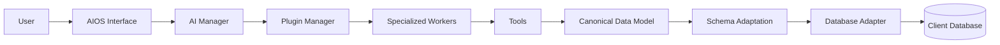
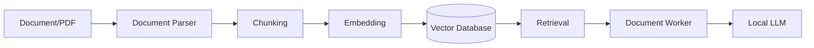
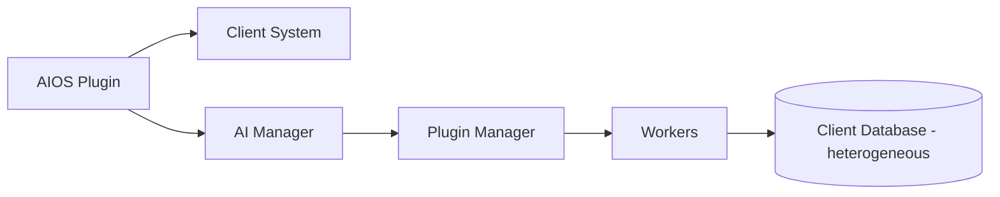

# Analisis Kebutuhan — AIOS Plugin Platform

**Proyek:** Prototype AIOS Plugin Platform (Immersion Program)
**Pelaksana:** Samuel Karel Augusta / 233016011
**Mitra:** Ekasa Technology (software house)
**Periode:** 10 Agustus 2026 – 12 Desember 2026 (18 minggu)
**Status:** Draft v1 — untuk direview dan diverifikasi bersama mentor

---

## 1. Ringkasan Eksekutif

AIOS (*AI Operating System*) adalah prototype **platform AI berbasis plugin** yang
dipasang sebagai *layer* di atas sistem perusahaan (*client*) yang sudah berjalan.
Tujuannya bukan mengganti aplikasi client, melainkan menambahkan kemampuan AI
(menjawab pertanyaan, menganalisis data, membaca dokumen) tanpa client harus
membangun ulang sistemnya.

Prototype ini dibuat untuk membuktikan konsep **"plug in, adapt, use"**: AIOS
harus bisa menempel ke *client* dengan struktur *database* yang berbeda-beda —
bahkan yang nama tabel/kolomnya tidak bermakna — melalui analisis skema secara
*semantic* berbasis *local LLM*.

Hasil akhir yang ditargetkan: prototype berjalan lokal dengan banyak *worker*
spesialis (pola menyerupai tubeanalytic) yang mampu membaca data dari beberapa
*dataset* berbeda melalui *canonical data model*, plus *pipeline RAG* untuk
dokumen/PDF, lengkap dengan dokumentasi dan demo presentasi.

---

## 2. Latar Belakang

### 2.1 Konteks Ekasa Technology

Ekasa Technology adalah *software house* yang bekerja berdasarkan permintaan
*client*. Setiap permintaan *client* umumnya memiliki sistem *existing* dengan
arsitektur dan struktur *database* yang berbeda-beda. Ketika sebuah *client*
ingin menambahkan kemampuan AI pada sistemnya, pendekatan yang umum terjadi
adalah membangun solusi AI baru dari nol untuk setiap *client* — mahal, lambat,
dan tidak dapat digunakan kembali.

### 2.2 Masalah

1. Tidak ada *layer* AI yang **reusable** lintas *client*.
2. Memahami struktur *database client* yang beragam biasanya dilakukan dengan
   *mapping* manual / *hardcoded* yang hanya berlaku untuk satu *client*.
3. Data terstruktur (*database*) dan data tak terstruktur (dokumen/PDF) belum
   diolah melalui satu jalur AI yang terpadu.
4. Penerapan AI sering dikaitkan dengan *cloud LLM*, sementara banyak *client*
   membutuhkan solusi yang berjalan lokal / menjaga privasi data.

### 2.3 Mengapa AIOS

AIOS dirancang sebagai *plugin/layer* yang **beradaptasi terhadap client**,
bukan sebaliknya. Dengan *AI Schema Analyzer* yang memahami struktur *database*
secara *semantic*, AIOS dapat mengenali bahwa `products.product_name`,
`barang.nama_barang`, dan `m_01.x2` dapat berarti hal yang sama dalam bentuk
*canonical data model*. Dengan begitu, satu platform dapat dipasang ke banyak
*client* dengan upaya integrasi yang jauh lebih kecil.

---

## 3. Masalah yang Ingin Diselesaikan

1. **Keterbatasan reuse** — tidak ada AI *layer* yang bisa dipasang ke berbagai
   sistem client dengan cara yang sama.
2. **Ketergantungan pada struktur** — analisis data hanya bisa dilakukan jika
   programmer memahami dan menulis query spesifik per *client*.
3. **Ketidakterhubungan data** — *data terstruktur* (database) dan *data tak
   terstruktur* (dokumen) diproses terpisah tanpa satu AI *layer*.
4. **Privasi / lokalitas** — kebutuhan AI yang berjalan lokal tanpa *cloud*.
5. **Mahalnya adopsi AI** — setiap *client* harus membangun solusi AI terpisah.

---

## 4. Tujuan

### 4.1 Tujuan Umum

Membangun prototype AIOS Plugin Platform yang membuktikan bahwa satu AI *layer*
dapat dipasang ke sistem *client* yang berbeda-beda tanpa mengubah sistem
*existing*, sesuai prinsip **"plug in, adapt, use."**

### 4.2 Tujuan Khusus (Prototype Scope)

Prototype dianggap berhasil jika mampu mendemonstrasikan **11 poin scope**:

1. **FR-01** — User dapat menggunakan AIOS.
2. **FR-02** — AI Manager dapat mengarahkan *task* ke *worker* yang sesuai.
3. **FR-03** — *Plugin* dapat memiliki *capability* yang berbeda.
4. **FR-04** — *Worker* dapat menggunakan *tools*.
5. **FR-05** — AIOS dapat membaca struktur *database client*.
6. **FR-06** — AI Schema Analyzer dapat memahami struktur yang berbeda.
7. **FR-07** — Struktur *client* dapat dipetakan ke *canonical model*.
8. **FR-08** — *Worker* dapat menggunakan *canonical model*.
9. **FR-09** — *RAG* dapat digunakan untuk dokumen/PDF.
10. **FR-10** — *Local LLM* dapat menjalankan AI secara lokal.
11. **FR-11** — AIOS terintegrasi sebagai *layer/plugin* tanpa mengubah sistem
    *client*.

### 4.3 Tujuan Magang

1. Menguasai *AI orchestration*: AI Manager, *plugin registry*, *worker system*,
   dan *tool system*.
2. Menerapkan integrasi *local LLM* (Ollama) dan *RAG*.
3. Mempraktikkan pola arsitektur adaptif untuk *database* heterogen
   (*schema analyzer* + *canonical model*).
4. Menghasilkan *prototype*, laporan, dan demo yang memenuhi penilaian mentor,
   pemilik Ekasa Technology, dan dosen pembimbing program.

---

## 5. Manfaat

### 5.1 Bagi Ekasa Technology

- Menjadi **produk konsep** yang dapat ditawarkan kepada *client* sebagai
  tambahan AI *capability* pada sistem mereka.
- Mengurangi biaya dan waktu integrasi AI karena memakai satu *layer* yang
  adaptif, bukan solusi sekali pakai per *client*.
- Modal pembicaraan bisnis dengan *client*: "tambahkan AI tanpa mengubah
  sistem Anda."

### 5.2 Bagi Client

- Mendapatkan kemampuan AI tanpa harus membangun ulang / mengubah sistem
  *existing*, tanpa *double login* (memanfaatkan konteks *authentication* yang ada).
- Data tetap berada di sistem mereka (solusi dapat berjalan lokal).

### 5.3 Bagi Pemagang

- Pengalaman nyata membangun arsitektur AI modular dan adaptif.
- Kompetensi baru: *LLM integration*, *RAG*, *prompt engineering*,
  analisis skema *database* berbasis AI.
- Portfolio prototype yang lengkap dan dapat didemonstrasikan.

### 5.4 Bagi Program Studi

- Implementasi nyata kegiatan *Immersion Program* yang menghubungkan teori
  kuliah dengan kebutuhan dunia kerja.
- Memperkuat kerja sama kampus dengan industri (*software house*).

---

## 6. Cakupan (In-Scope)

1. Arsitektur inti AIOS: AI Manager, Plugin Manager, Worker System, Tool System.
2. Integrasi *local LLM* (Ollama) untuk semua peran.
3. *Database Adapter*: SQLite, PostgreSQL, MySQL.
4. *Schema Extraction* + AI Schema Analyzer (pemahaman semantik).
5. *Canonical Data Model* + *mapping engine*.
6. *Worker* spesialis: Inventory, Document, Analytics.
7. *Pipeline RAG* untuk dokumen/PDF.
8. *AIOS Interface*: antarmuka pengguna (chat) + API.
9. Simulasi integrasi ke 4 *dataset* berbeda.
10. *End-to-end testing* + dokumentasi + demo.

---

## 7. Batasan Masalah dan Non-Goals

### 7.1 Batasan Teknis

- Durasi: 18 minggu (10 Agustus – 12 Desember 2026).
- Berjalan **lokal** (Ollama), tanpa *cloud LLM* kecuali ada alasan teknis jelas.
- Hardware: AMD Ryzen 5 5600G, 16 GB RAM, tanpa GPU dedicated (CPU-only).
  Model harus kecil dan ringan.
- Prototype tidak *production-ready*, namun setiap fitur inti harus benar-benar
  berfungsi untuk membuktikan *feasibility*.

### 7.2 Non-Goals (yang TIDAK dilakukan)

- **Bukan** chatbot biasa.
- **Bukan** *single-purpose AI*.
- **Bukan** *database-specific AI*.
- **Bukan** pengganti (*replacement*) sistem *client*.
- **Bukan** sistem *authentication* baru (tanpa JWT baru yang tidak perlu;
  memanfaatkan konteks auth *client*).
- **Bukan** *cloud-only AI*.
- **Bukan** AI yang butuh *retraining* untuk setiap *client*.
- **Bukan** *worker* yang *direct-access database*.
- **Bukan** *hardcoded mapping* untuk setiap *client*.
- Tidak mengubah *database client* agar cocok dengan AIOS.

---

## 8. Stakeholder dan User

| Stakeholder | Peran | Kebutuhan Utama |
|---|---|---|
| **Client** | Pengguna akhir sistem | AI *capability* tanpa mengubah sistem mereka |
| **Ekasa Technology** | Mitra / penyedia jasa | Produk AIOS yang bisa ditawarkan ke banyak client |
| **Pemagang (Samuel)** | Pelaksana & pengembang | Prototype lengkap, kompetensi baru, portfolio |
| **Mentor / Pemilik Ekasa** | Pembimbing & penilai | Kualitas prototype, kesesuaian kebutuhan |
| **Dosen Pembimbing Program** | Penilai akademik | Dokumentasi, laporan, presentasi |

---

## 9. Use Case / User Stories

1. *"Sebagai staf gudang, saya bertanya 'stok barang X berapa?' dan AIOS
   menjawab dari database client tanpa saya perlu memahami struktur database."*
2. *"Sebagai manager, saya ingin ringkasan penjualan bulan ini dari sistem
   yang sudah ada."*
3. *"Sebagai staff admin, saya bertanya isi kontrak/PDF tanpa harus membuka
   file-nya satu per satu."*
4. *"Sebagai pemilik software house, saya ingin satu AIOS bisa dipasang ke
   client mana pun tanpa menulis kode integrasi baru per client."*

Use case diagram dan flowchart lengkap dibuat sebagai file `.drawio` dan
mermaid copy di dokumen diagram (lihat Lampiran A).

---

## 10. Kebutuhan Fungsional (FR)

Dipetakan langsung dari *Prototype Scope* (11 poin), dengan rincian
*penerimaan* per fitur:

| ID | Kebutuhan | Detail / Penerimaan |
|---|---|---|
| FR-01 | User dapat menggunakan AIOS | Terdapat *AIOS Interface* tempat user mengirim pertanyaan dan menerima jawaban |
| FR-02 | AI Manager mengarahkan task ke worker | Pertanyaan user di-*route* ke worker yang sesuai (inventory/document/analytics) |
| FR-03 | Plugin memiliki capability berbeda | Plugin Manager dapat mendaftarkan plugin dengan *capability* yang berbeda |
| FR-04 | Worker dapat menggunakan tools | Worker memanggil *tools* (mis. baca data, cari dokumen), bukan akses DB langsung |
| FR-05 | AIOS membaca struktur database client | *Database Connector + Schema Extraction* menghasilkan metadata schema |
| FR-06 | AI Schema Analyzer memahami struktur berbeda | Analisis semantik bekerja pada Northwind, Chinook, varian Indonesia, dan varian obfuscated |
| FR-07 | Struktur client dipetakan ke canonical model | `products.product_name`, `barang.nama_barang`, `m_01.x2` → `Product.name` |
| FR-08 | Worker menggunakan canonical model | Worker menjawab pertanyaan melalui *canonical data model* |
| FR-09 | RAG untuk dokumen/PDF | Dokumen diparse, di-*chunk*, di-*embedding*, di-retrieval, dijawab |
| FR-10 | Local LLM menjalankan AI lokal | Semua peran berjalan di Ollama (`qwen2.5:7b` default, *configurable*) |
| FR-11 | AIOS terintegrasi sebagai layer tanpa mengubah sistem client | Sistem client dijalankan apa adanya; AIOS hanya menempel di atasnya |

---

## 11. Kebutuhan Non-Fungsional (NFR)

| ID | Aspek | Kebutuhan |
|---|---|---|
| NFR-01 | *Modularity* | Komponen (AI Manager, Plugin, Worker, Tool, Adapter) terpisah dan dapat diganti |
| NFR-02 | *Client adaptability* | Tidak ada asumsi *hardcoded* tentang nama tabel/kolom client |
| NFR-03 | *Local-first* | Berjalan penuh secara lokal (Ollama, tanpa *cloud LLM*) |
| NFR-04 | *Security & data privacy* | Worker tidak *direct-access* database; akses lewat *canonical model* |
| NFR-05 | *Performance* | Ringan; model dibatasi ukuran agar muat di 16 GB RAM CPU-only |
| NFR-06 | *Maintainability* | Kode sederhana, terdokumentasi, tidak *over-engineered* |
| NFR-07 | *Configurability* | Model per worker dapat diganti via konfigurasi, tanpa ubah kode |
| NFR-08 | *Simplicity* | Tidak menambah framework/library tanpa alasan jelas |

---

## 12. Arsitektur dan Alur Sistem

### 12.1 Alur Umum

Alur lain (terpisah, untuk dokumen tak terstruktur):

### 12.2 Konsep "Plug in, adapt, use"

*Client* tetap mempertahankan aplikasi, database, authentication, user/role,
dan business logic mereka. AIOS hanya menambah *layer* AI di atasnya.

### 12.3 Catatan

- Diagram resmi (flowchart, use case, arsitektur) disimpan sebagai file
  `.drawio` di folder `docs/diagrams/` (Lampiran A).
- *RAG pipeline* **tidak dicampur** dengan *database schema adaptation*:
  RAG untuk data tak terstruktur, database adaptation untuk data terstruktur.

---

## 13. Teknologi

| Komponen | Pilihan | Catatan |
|---|---|---|
| Bahasa utama | Python | Sesuai keputusan project |
| *Local LLM* | Ollama + `qwen2.5:7b` | Default semua peran; *configurable* per worker |
| *Embedding* | `nomic-embed-text` | Untuk *RAG* / *vector store* |
| *Database Adapter* | SQLite, PostgreSQL, MySQL | Sesuai kebutuhan prototype |
| *Dataset sample* | Northwind, Chinook, varian retail Indonesia, varian obfuscated | 4 struktur sengaja berbeda |

---

## 14. Risiko dan Mitigasi

| Risiko | Dampak | Mitigasi |
|---|---|---|
| Kualitas analisis schema model kecil kurang akurat | Salah *mapping* canonical | Pakai *sample data* + *value patterns*; model dapat di-upgrade per peran |
| Ukuran model melebihi kapasitas RAM CPU-only | Lambat / gagal jalan | Batasi ukuran model; jalankan satu inferensi pada satu waktu |
| Complexity analisis semantik tidak terbukti | Konsep inti gagal | Uji bertahap dari schema paling mudah ke paling sulit (Northwind → obfuscated) |
| Scope terlalu luas untuk 18 minggu | Tidak selesai | Prioritas per fase; jangan pindah fase sebelum fase saat ini lulus verifikasi |
| Dokumentasi tertinggal | Nilai akhir menurun | Dokumen di-update setiap akhir fase |

---

## 15. Definisi Selesai (Acceptance Criteria)

Prototype dinyatakan **selesai** jika:

1. Ke-11 *Prototype Scope* (FR-01 s.d. FR-11) dapat didemonstrasikan.
2. AIOS berhasil bekerja pada **minimal 4 dataset** dengan struktur berbeda.
3. *Pipeline RAG* dapat menjawab pertanyaan dari dokumen/PDF.
4. Semua berjalan **lokal** melalui Ollama.
5. Sistem *client* tidak diubah sama sekali selama integrasi.
6. Dokumentasi (analisis, laporan, diagram, panduan) lengkap.
7. Presentasi demo final dapat dijalankan dengan lancar.

---

## 16. Referensi

- `AGENTS.md` — dokumen konsep dan keputusan arsitektur utama project ini.
- `jadwal-magang-ekasa.xlsx` — jadwal 18 minggu dan *deliverable* per minggu.
- `template-dokumen/template-laporan-akhir.pdf` — struktur laporan akhir.
- `template-dokumen/LAPORAN MINGGU 1 ...` — format laporan mingguan.

---

## Lampiran A — Daftar Diagram (files)

| File | Jenis | Status |
|---|---|---|
| `docs/diagrams/flowchart-sistem.drawio` | Flowchart alur sistem | Dibuat (v1) |
| `docs/diagrams/use-case-diagram.drawio` | Use case diagram | Dibuat (v1) |
| `docs/diagrams/arsitektur-sistem.drawio` | Arsitektur sistem | Dibuat (v1) |
